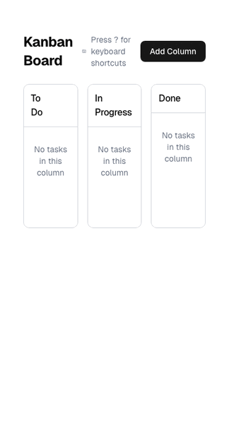

# Almedia Kanban Board

## Live Preview

**[View Live Demo](https://almedia-test.vercel.app/)** - Deployed on Vercel



_Interactive demo showing the complete kanban workflow: initial load, task creation with comments, help modal, and drag-and-drop functionality._

## Project Overview

This is a test project implementing a feature-complete Kanban board with task prioritization. Started, paused, continued with better organization - rebuilt components while keeping store architecture. Includes comprehensive e2e tests with visual snapshots.

**Required Features Implemented:**

- [x] Dynamic columns (add/rename/delete columns, starts with To Do/In Progress/Done)
- [x] Task cards (add/edit/delete tasks with title and description)
- [x] Task details & comments (modal view with add/edit/delete comments)
- [x] Drag and drop (move tasks between columns and reorder within columns)
- [x] Data persistence (localStorage with schema validation)

**Additional Features:** Task priority system with Eisenhower Matrix, keyboard shortcuts, responsive design, scroll indicators.

**Architecture:** Three-store pattern - TaskStore (task data), ColumnStore (column management), BoardStore (task-column relationships). Built using React + TypeScript template with CI, quality gates, and MobX state management.

**Review Focus:** Implementation located in `src/features/kanban` - contains complete feature architecture, components, hooks, and stores.

---

A modern Kanban board application built with React + TypeScript. Features drag-and-drop task management and a clean, responsive interface.

## Quick Start

```bash
pnpm install
pnpm dev
```

Open [http://localhost:5173](http://localhost:5173) - you're ready to code.

## What's Included

- **Vite** - Lightning-fast builds and HMR
- **Tailwind CSS + shadcn/ui** - Modern styling and components
- **MobX** - Reactive state management
- **TypeScript** - Type safety with strict mode
- **Testing** - Vitest + Playwright + Visual regression
- **Storybook** - Component development and documentation
- **Code Quality** - Biome linting, pre-commit hooks
- **CI/CD** - GitHub Actions pipeline
- **Docker** - Development and production containers

## Project Structure

```
src/
├── features/           # Business features (your main code)
│   └── todo/          # Example: Complete todo app
├── components/        # Reusable UI components
│   ├── ui/           # shadcn/ui components
│   └── custom-ui/    # Custom components + FormBuilder
├── stores/           # Global MobX stores
├── providers/        # React context providers
├── hooks/            # Custom React hooks
├── lib/              # Utilities and shared logic
└── services/         # API clients
```

## Key Features

### Feature-Based Architecture

Each feature is self-contained with its own components, state, and routes:

```typescript
features/my-feature/
├── Component.tsx     # UI components
├── store.ts         # MobX store
├── routes.ts        # Route configuration
├── schemas.ts       # Zod validation
└── index.ts         # Feature registry
```

### Schema-First Development

Types derived from Zod validation schemas:

```typescript
// schemas.ts
export const TodoSchema = z.object({
  id: z.string().min(1),
  text: z.string().min(1).trim(),
  completed: z.boolean(),
});

// types.ts
export type Todo = z.infer<typeof TodoSchema>;
```

### Dynamic Form Builder

Powerful form generation with validation:

- All field types included
- Zod schema integration
- Field arrays and nested forms
- See examples in Storybook

## Commands

| Command           | Description              |
| ----------------- | ------------------------ |
| `pnpm dev`        | Start development server |
| `pnpm build`      | Build for production     |
| `pnpm test`       | Run unit tests           |
| `pnpm test:e2e`   | Run E2E tests            |
| `pnpm storybook`  | Start Storybook          |
| `pnpm lint`       | Run linter               |
| `pnpm type:check` | Check TypeScript         |

[View all commands →](CONTRIBUTING.md#scripts-reference)

## Docker

```bash
pnpm docker:dev       # Development with hot reload
pnpm docker:prod      # Production build
```

## Documentation

| Guide                                    | Description                                |
| ---------------------------------------- | ------------------------------------------ |
| [**Contributing**](CONTRIBUTING.md)      | Development setup, workflows, code quality |
| [**Architecture**](docs/ARCHITECTURE.md) | System design, patterns, project structure |
| [**Testing**](docs/TESTING.md)           | Unit, E2E, visual regression strategies    |
| [**Deployment**](docs/DEPLOYMENT.md)     | CI/CD, Docker, production deployment       |

## Getting Started

### 1. Create a New Feature

```bash
# Create feature folder
mkdir src/features/my-feature
cd src/features/my-feature

# Required files
touch index.ts Component.tsx routes.ts schemas.ts
```

### 2. Add UI Components

```bash
# Add shadcn components
npx shadcn@latest add button card

# Check existing components
ls src/components/ui/
```

### 3. Explore Examples

- **Todo App** - Complete CRUD with MobX state
- **API Demo** - External API integration
- **Form Builder** - Dynamic form generation

## What Makes This Different

- **Zero Configuration** - Works out of the box
- **Production Ready** - CI/CD, testing, Docker included
- **Developer Experience** - Storybook, hot reload, type safety
- **Scalable Architecture** - Feature-based organization
- **Modern Stack** - Latest tools and best practices

---

**Happy coding!**

Questions? Check the [Contributing Guide](CONTRIBUTING.md) or open an issue.
